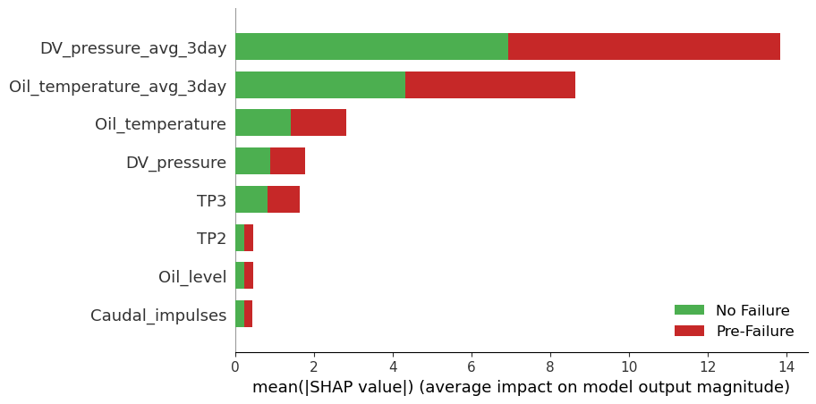

# Proactive Failure Prediction in Train Air Production Units Using XGBoost for Enhanced Safety

## Overview

This project aims to proactively predict failures in train air production units using the **MetroPT3 dataset** and **XGBoost**, improving operational safety and maintenance planning. It involves preprocessing large-scale sensor data, training several machine learning models, and interpreting results with SHAP (SHapley Additive exPlanations).

---

## Objectives

- Anticipate failures in train air production units by detecting pre-failure states.
- Use the XGBoost model for accurate and reliable prediction, along with other models (RF, DT, KNN, LR) for comparison.
- Apply interpretable analysis using SHAP to understand model decisions.
- Allow direct reuse of pre-trained models without the need to rerun training.
- Provide ready-to-use results with preprocessed data and precomputed SHAP analyses.

---

## Dataset

**Source:** [Kaggle - MetroPT3 Dataset](https://www.kaggle.com/datasets/joebeachcapital/metropt-3-dataset)

- **Period:** February – August 2020
- **Sampling Rate:** 1 Hz
- **Total Records:** 15,169,480
- **Features:** 15 (7 analog + 8 digital)

> [!NOTE]
> Before running the project, download the dataset from Kaggle and place it in the `data/raw/` directory.

---

## Project Structure

```plaintext
Proactive-Failure-Prediction-in-Train-Air-Production-Units-Using-XGBoost-for-Enhanced-Safety/
├── data/                            # All data files used in the project
│   ├── raw/                         # Raw dataset (e.g., MetroPT3(AirCompressor).csv)
│   ├── processed/                   # Cleaned and preprocessed data (e.g., X_train.csv, X_test.csv, etc.)
│   ├── predictions/                 # Model predictions stored as CSVs
│   └── shap/                        # SHAP values for model interpretability
│
├── models/                          # Trained models saved as .pkl files (e.g., xgboost_model.pkl)
│
├── notebooks/                       # Jupyter Notebooks for each step of the pipeline
│   ├── 01_data_exploration.ipynb        # Exploratory Data Analysis (EDA)
│   ├── 02_data_preprocessing.ipynb      # Preprocessing, feature engineering (3-day rolling averages), normalization
│   ├── 03_model_training.ipynb          # Training multiple models: XGBoost, KNN, Logistic Regression, etc.
│   ├── 04_results.ipynb                 # Evaluation of models (accuracy, precision, recall, ROC curves)
│   └── 05_model_interpretation.ipynb    # SHAP-based interpretation of the XGBoost model
│
├── src/                             # Modular Python scripts for reusable logic
│   ├── data/
│   │   └── preprocess.py            # Functions for data cleaning, transformation, and splitting
│   ├── models/
│   │   ├── train.py                 # Functions for training different models
│   │   └── evaluate.py              # Functions to calculate and visualize performance metrics
│   └── utils/
│       └── helpers.py               # Utility functions for:
│                                   # - Plotting ROC curves
│                                   # - Generating and saving classification reports
│
├── requirements.txt                # Required Python libraries (pandas, sklearn, xgboost, shap, etc.)
└── README.md                       # Project documentation (this file)

```

---

## Getting Started

### Prerequisites

- Python 3.8 or higher
- Jupyter Notebook
- Git

### Installation

#### 1. Clone the repository
```bash
git clone https://github.com/YahiaouiLydia/Proactive-Failure-Prediction-in-Train-Air-Production-Units-Using-XGBoost-for-Enhanced-Safety.git
cd Proactive-Failure-Prediction-in-Train-Air-Production-Units-Using-XGBoost-for-Enhanced-Safety
```

#### 2. (Optional) Create a virtual environment
```bash
python -m venv venv
source venv/bin/activate  # On Windows: venv\Scripts\activate
```

#### 3. Install dependencies
```bash
pip install -r requirements.txt
```

> [!TIP]
> It's recommended to run the project inside a virtual environment to manage dependencies.

---

## How to Run the Project

Run the Jupyter notebooks in the following order:

1. **Data Exploration**
   - `notebooks/01_data_exploration.ipynb`
   - Visualize and understand the raw sensor data

2. **Data Preprocessing**
   - `notebooks/02_data_preprocessing.ipynb`
   - Clean and process the dataset, generate engineered features, and create train/test splits (saved in `data/processed/`)

3. **Model Training**
   - `notebooks/03_model_training.ipynb`
   - Train XGBoost and other ML models and save them to `models/`

4. **Model Evaluation**
   - `notebooks/04_results.ipynb`
   - Evaluate models using accuracy, precision, recall, F1, ROC curves
   - Save predictions to `data/predictions/`

5. **Model Interpretation**
   - `notebooks/05_model_interpretation.ipynb`
   - Analyze model behavior using SHAP and store visualizations in `data/shap/`

> [!CAUTION]
> Preprocessing and training might be resource-intensive due to the dataset size.

> [!TIP]
> To save time, use the existing trained models and SHAP analysis provided in the repository.

---

## Results

### Model Performance (XGBoost Example)

- Accuracy: 99.95%
- Precision: 99.95%
- Recall: 99.95%
- F1 Score: 99.95%
- ROC AUC: 1.00

Performance plots and classification reports are saved as PNG files in the evaluation notebook.

---

## SHAP Interpretation

### Key Insights

- **Top Features**:
  - `DV_pressure_avg_3day` — High relevance to pre-failure state
  - `Oil_temperature_avg_3day` — Elevated temperatures linked to failures

- **Less Important**:
  - `LPS`, `Pressure_switch`

### SHAP Summary Plot



- **X-axis**: Mean absolute SHAP value (feature impact)
- **Y-axis**: Sorted features
- **Color Legend**:
  - Red = Pre-Failure (1)
  - Green = No Failure (0)

---

